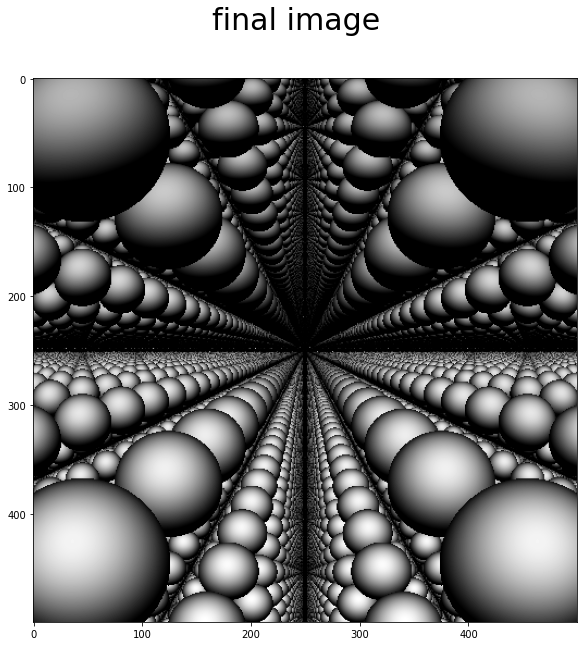

# Ray marching на чистом numpy

[Оригинальный пост в моём канале](https://t.me/galbdm/703)



На днях я понял, что numpy (библиотека для быстрой работы с многомерными массивами на питоне) идеально подходит для того, чтобы написать на ней ray marcher.

Если кто не знает -- ray marching это техника рендеринга сцен, в которой лучи итеративно "прощупывают" сцену с помощью лишь функции расстояния до ближайшего объекта. Если алгоритм рассматривает луч в какой-то точке и знает расстояние до сцены, то это значит, что можно пройти это расстояние в направлении луча и ничего не задеть. Алгоритм проходит ровно это расстояние, и приступает к следующей итерации.

Моя идея заключается в том, чтобы numpy оперировал со всеми лучами одновременно (с точки зрения питона). Это значит, что "прощупывание" сцены будет происходить с помощью всего одной строчки в цикле.
``` python
position += dist(position) * rays #псевдокод
```

Я набросал демку и выложил в общий доступ сюда. Сейчас пытаюсь прикрутить какую-нибудь крутую функцию расстояния до фрактала к этому, буду держать в курсе.